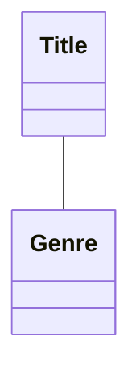
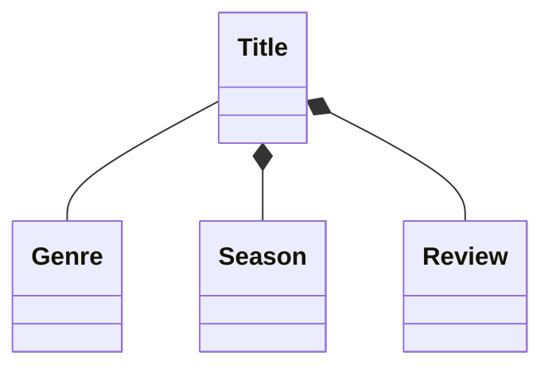
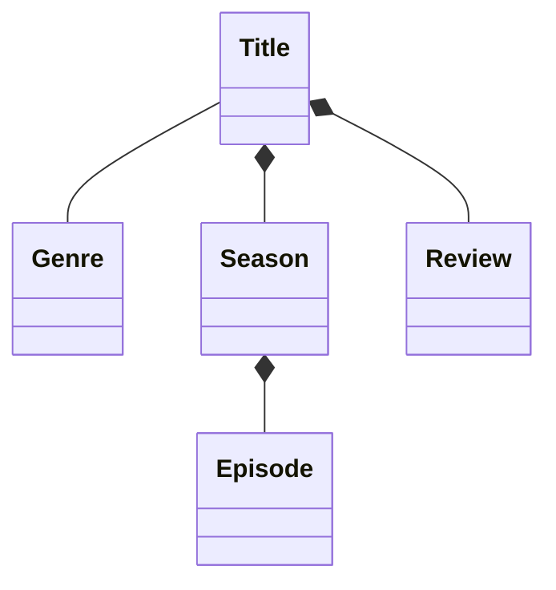
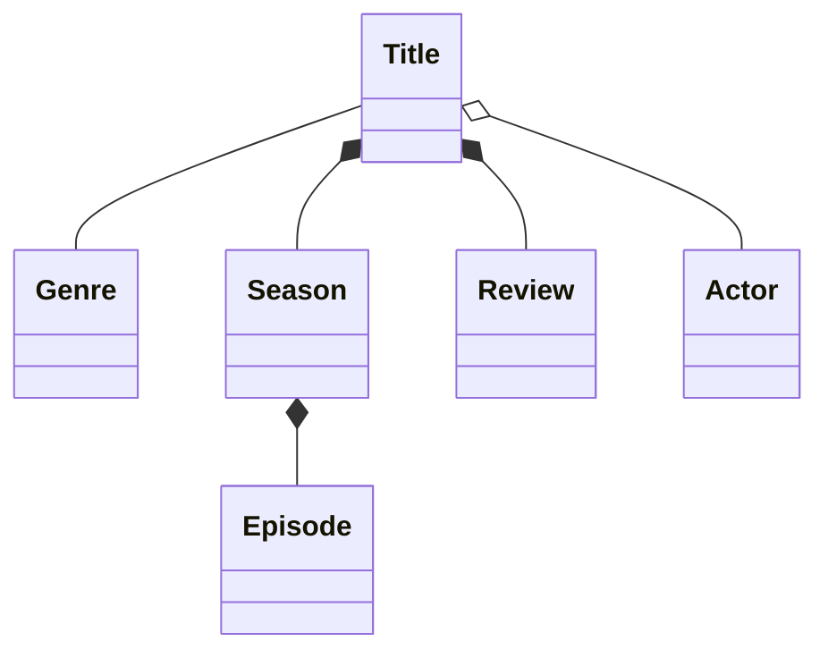
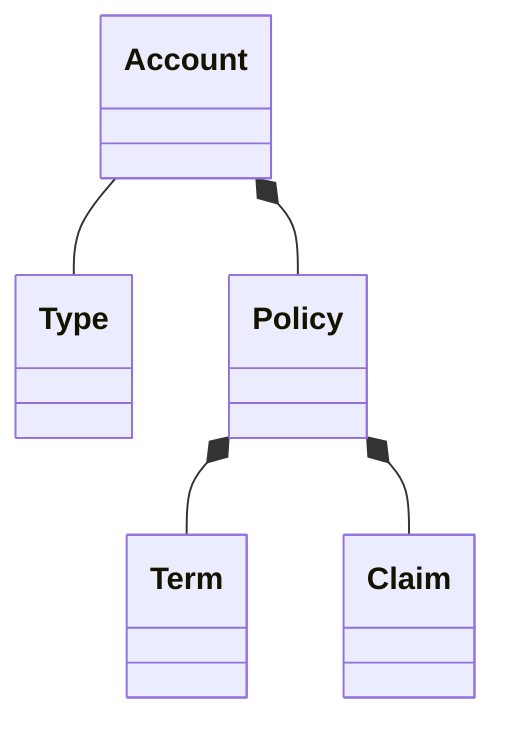
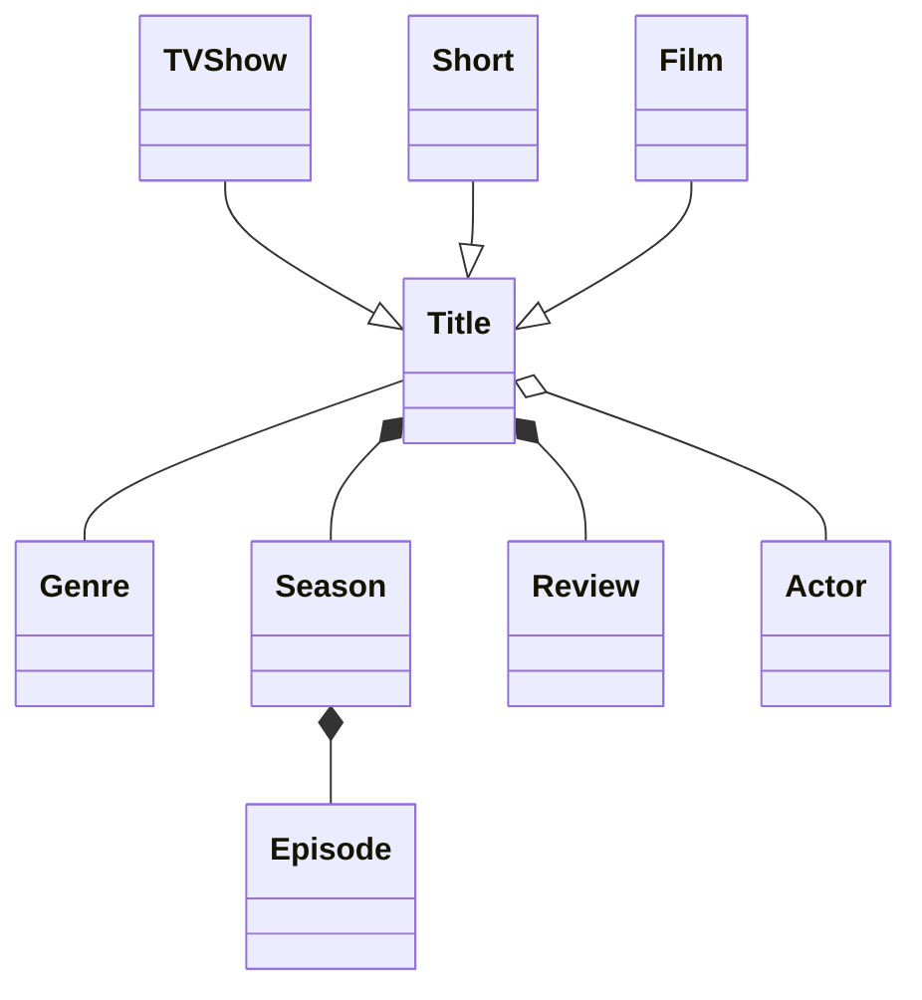

# Modeling domain

Domain modeling is the primary way of determining the important aspects of a business
DDD is the methodology used to bring that domain model to life in your day-to-day work.

### Association 
- for a relationship to be classed as an association, the entities must be able to exist dependently of one another and likely have their own life cycles
- using: Furthermore, there is generally no “owner” of the relationship for associations

### Composition
- **Season**
- **Review**
- we have to think about how each of these behave in relation to **Title**
	- They don’t make sense on their own like an association, and without **Title**
	- they probably make no sense at all in our domain
-

The side the diamond is on indicates the class holding the reference
you can think of it similarly to a parent and child relationship:
- the diamond signifies the parent, 
- as the child cannot exist without the parent
- the parent is the owner of the relationship

#### completed composition

### Aggregate
The syntax for aggregate relationships is o--
An aggregate relationship is also displayed as a diamond: empty diamond.
In an aggregate relationship, there’s still an owner—the parent. 
However, the bond between them isn’t as strong as a composite relationship, and if the parent were to be deleted, the child can still exist

(if we were to model **Cast** instead of **Actor**, then it could form a composite relationship)

### Decide between Association Aggregation, and Composition
#### Association
there’s a relationship between the entities, with at least one entity holding a reference to the other. There’s no owner of the relationship though, and they can exist completely independently of one another. 
An example might be a Teacher and Student relationship.
#### Aggregations
there’s a more direct relationship between the entities than an association, but they can still exist independently of one another. 
There’s an owner of the relationship, but if the parent is deleted, the child can still remain. Continuing the education theme, a Teacher has an aggregate relationship to Class.
You could delete the Teacher, but the Class would still remain and make sense on its own.
#### Compositions
the closest of relationships is reserved for compositions. Similarly to aggregations, there’s an owner of the relationship. However, if the parent is deleted, the child must be deleted, too, and makes no sense without its parent relationship.
Grade could be a composite relation to Class

### try another domain

# Enhancing domain model
with rich information
- inheritance, subtypes
- multiplicity

## Define Inheritance

**TV Show, Film**, and **Short** might be represented as subclasses of **Title**
UML: generalization

